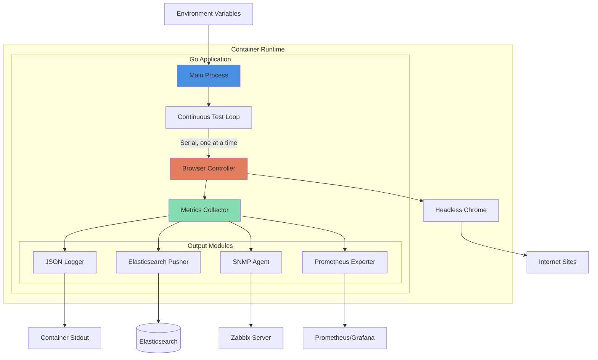
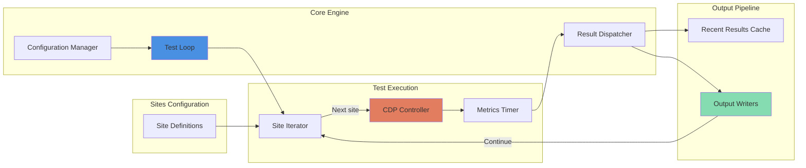
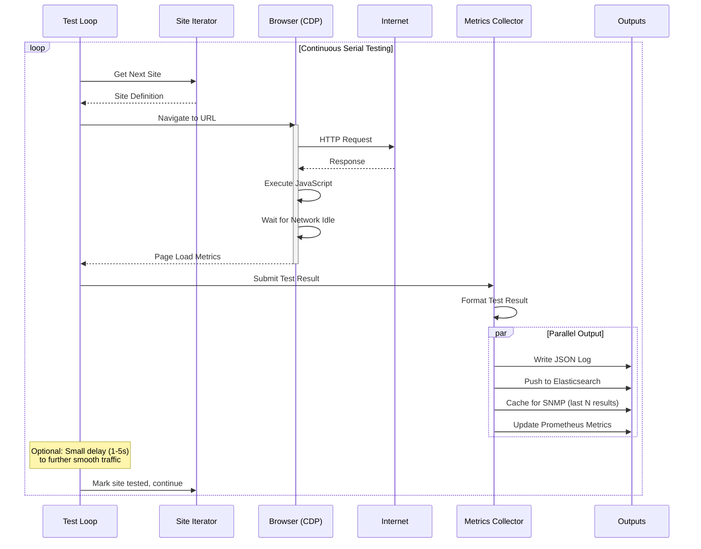
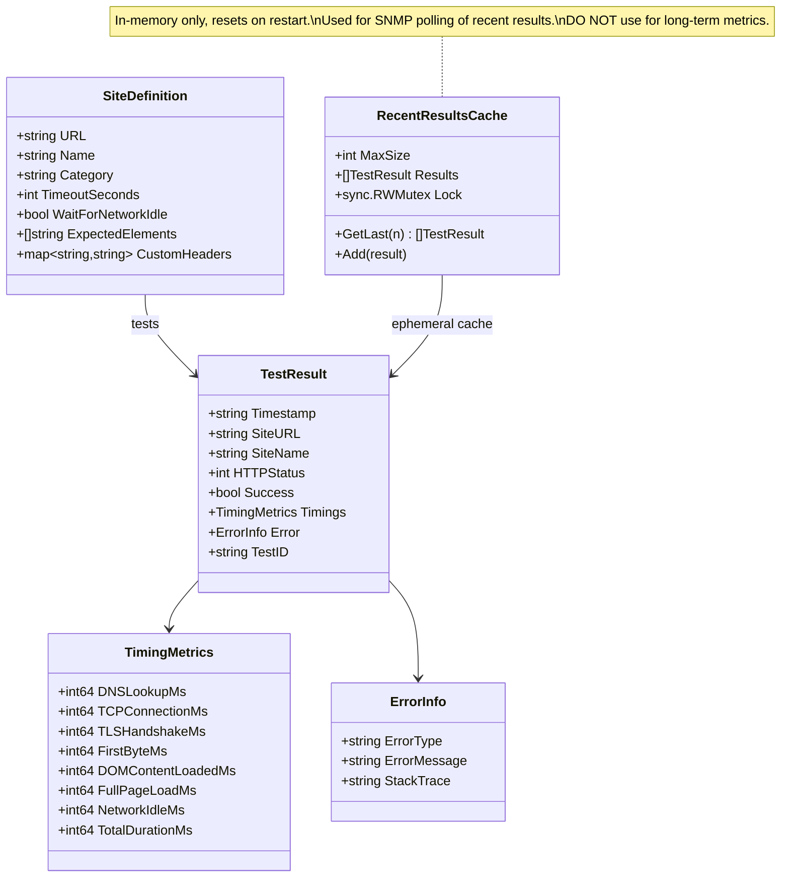
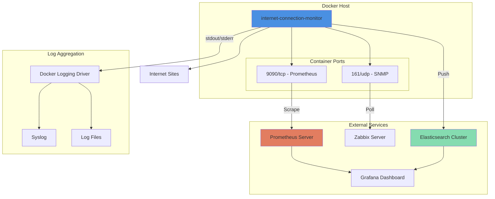

# Internet Connection Monitor - Implementation Design

## Technology Stack

### Core Application
- **Language**: Go 1.21+
  - Proven choice in this repository (network-mapper)
  - Excellent concurrency primitives for parallel testing
  - Cross-platform binary compilation
  - Strong standard library for HTTP operations

### Browser Automation
- **Primary**: Chromium via Chrome DevTools Protocol (CDP)
  - **Library**: `chromedp` (https://github.com/chromedp/chromedp)
  - Headless browser automation
  - Low resource overhead
  - No external dependencies (bundles headless Chrome)
  - Supports JavaScript execution timing
  - Can capture real page load metrics (DOM loaded, network idle, etc.)

### Monitoring Interfaces

#### 1. Logging
- **Format**: JSON Lines (jsonl)
- **Library**: Standard `encoding/json` + `log/slog` (Go 1.21+)
- **Output**: stdout (Docker best practice)

#### 2. Elasticsearch Push
- **Library**: `olivere/elastic` v7
- **Protocol**: HTTPS REST API
- **Batching**: Buffer and send in batches to reduce overhead

#### 3. SNMP Server
- **Library**: `gosnmp/gosnmp` for SNMP agent
- **MIB**: Custom enterprise MIB for Internet monitoring
- **OIDs**: Expose raw data from recent tests (last 100 results cached in-memory)
  - Individual test latencies (last N tests per site)
  - Success/failure status for each test
  - Timestamp of last successful test per site
  - **Note**: Values reset on container restart; Zabbix should store and trend these values

#### 4. Prometheus/HTTP Scrape Endpoint
- **Library**: `prometheus/client_golang`
- **Format**: Prometheus text format
- **Metrics**: Gauges for latency, counters for success/failure, histograms for timing distribution

### Configuration
- **Primary**: Environment variables (Docker-friendly)
- **Fallback**: YAML configuration file
- **Library**: `spf13/viper` (supports both env vars and files)

### Docker Base
- **Base Image**: `chromedp/headless-shell:latest`
  - Purpose-built for headless Chrome automation
  - Minimal overhead
  - Well-maintained
- **Alternative**: Multi-stage build with `golang:1.21-alpine` + Chrome installation

## Architecture Overview



## Component Architecture



## Data Flow



## Test Result Data Model



## Configuration Schema

```mermaid
graph TD
    Root[Configuration Root]

    Root --> General[General Settings]
    Root --> Sites[Sites Configuration]
    Root --> Outputs[Output Configuration]
    Root --> Browser[Browser Settings]

    General --> Delay[Inter-Test Delay: 2s]
    General --> Timeout[Global Timeout: 30s]
    General --> CacheSize[Results Cache Size: 100]

    Sites --> DefaultSites[Default Site List]
    Sites --> CustomSites[Custom Sites from Config]
    DefaultSites --> Google[google.com]
    DefaultSites --> CloudFlare[1.1.1.1]
    DefaultSites --> GitHub[github.com]

    Outputs --> Log[Logging Config]
    Outputs --> ES[Elasticsearch Config]
    Outputs --> SNMPCfg[SNMP Config]
    Outputs --> PromCfg[Prometheus Config]

    Log --> LogLevel[Level: info]
    Log --> LogFormat[Format: json]

    ES --> ESEnabled[Enabled: false]
    ES --> ESEndpoint[Endpoint URL]
    ES --> ESIndex[Index Pattern]
    ES --> ESAuth[Authentication]

    SNMPCfg --> SNMPEnabled[Enabled: true]
    SNMPCfg --> SNMPPort[Port: 161]
    SNMPCfg --> Community[Community String]

    PromCfg --> PromEnabled[Enabled: true]
    PromCfg --> PromPort[Port: 9090]
    PromCfg --> PromPath[Path: /metrics]

    Browser --> Headless[Headless: true]
    Browser --> UserAgent[User Agent]
    Browser --> WindowSize[Window Size]

    style Root fill:#4a90e2
    style Outputs fill:#85dcb0
    style Sites fill:#e27d60
```



## Deployment Architecture



## File Structure

```
internet-connection-monitor/
├── cmd/
│   └── monitor/
│       └── main.go                 # Entry point with continuous test loop
├── internal/
│   ├── browser/
│   │   ├── controller.go           # CDP browser control
│   │   └── metrics.go              # Browser timing metrics
│   ├── config/
│   │   ├── config.go               # Configuration loading
│   │   └── sites.go                # Site definitions
│   ├── testloop/
│   │   ├── loop.go                 # Continuous test loop logic
│   │   └── iterator.go             # Site iterator (round-robin)
│   ├── metrics/
│   │   ├── collector.go            # Metrics collection
│   │   ├── cache.go                # Recent results cache (ephemeral)
│   │   └── dispatcher.go           # Result distribution to outputs
│   ├── outputs/
│   │   ├── logger.go               # JSON logging
│   │   ├── elasticsearch.go        # ES pusher
│   │   ├── snmp.go                 # SNMP agent
│   │   └── prometheus.go           # Prometheus exporter
│   └── models/
│       ├── result.go               # Test result types
│       └── site.go                 # Site definition types
├── configs/
│   ├── default_sites.yaml          # Default site list
│   └── config.example.yaml         # Example full config
├── deployments/
│   ├── docker-compose.yml          # Standalone deployment
│   └── docker-compose.with-stack.yml # Full monitoring stack
├── scripts/
│   └── test-local.sh               # Local testing script
├── Dockerfile                      # Multi-stage build
├── .devcontainer/
│   └── devcontainer.json           # Dev environment
├── go.mod
├── go.sum
├── README.md
├── DESIGN.md                       # This file
└── LICENSE
```

## Implementation Phases

### Phase 1: Core Testing Engine
- [ ] Project scaffolding with Go modules
- [ ] Configuration management (env vars + YAML)
- [ ] Browser controller using chromedp
- [ ] Basic site testing with timing metrics
- [ ] JSON logging to stdout
- [ ] Default site list (google.com, cloudflare.com, github.com)

### Phase 2: Continuous Test Loop
- [ ] Site iterator (round-robin through site list)
- [ ] Continuous test loop (serial, one site at a time)
- [ ] Configurable inter-test delay for traffic smoothing
- [ ] Recent results cache (in-memory, ephemeral)
- [ ] Error handling (continue to next site on failure)

### Phase 3: Monitoring Outputs
- [ ] Elasticsearch pusher with batching
- [ ] SNMP agent implementation
- [ ] Prometheus metrics exporter
- [ ] Health check endpoint

### Phase 4: Docker & Deployment
- [ ] Multi-stage Dockerfile
- [ ] Docker Compose for standalone deployment
- [ ] Docker Compose with full stack (ES, Grafana, Prometheus)
- [ ] Documentation for deployment scenarios

### Phase 5: Advanced Features
- [ ] Custom site definitions via config
- [ ] Element-based success criteria (check for specific DOM elements)
- [ ] Screenshot capture on failures
- [ ] Configurable user agents
- [ ] Geographic/DNS server selection

### Phase 6: CI/CD & Distribution
- [ ] GitHub Actions for build and test
- [ ] Multi-arch Docker images (amd64, arm64)
- [ ] GitHub Releases with binaries
- [ ] Docker Hub publishing
- [ ] GHCR publishing

## Key Design Decisions

### Why Go?
- Proven in this repository (network-mapper)
- Excellent concurrency for parallel testing
- Single binary deployment
- Strong ecosystem for monitoring tools
- Cross-platform compilation

### Why Continuous Serial Testing Instead of Scheduled Intervals?

**The monitor runs tests continuously, one at a time, rather than in batches at intervals.**

#### Benefits of Serial Execution
1. **Mimics Real User Behavior**: Like a person browsing the web continuously
2. **No Traffic Spikes**: Steady, predictable network load instead of periodic bursts
3. **Simpler Architecture**: No scheduler, no worker pool, no coordination complexity
4. **Predictable Resource Usage**: Consistent CPU/memory footprint
5. **Network-Friendly**: Avoids sudden bandwidth spikes that could affect other users
6. **Easier to Reason About**: Single control flow, straightforward error handling

#### How It Works
```go
// Pseudocode of main loop
func RunContinuousMonitoring(sites []Site, config Config) {
    iterator := NewSiteIterator(sites) // Round-robin iterator
    browser := NewBrowserController()

    for {
        site := iterator.Next()

        result := browser.TestSite(site)

        // Emit to all outputs in parallel
        go outputs.EmitResult(result)

        // Optional delay to smooth traffic
        if config.InterTestDelay > 0 {
            time.Sleep(config.InterTestDelay)
        }
    }
}
```

**Key characteristics:**
- Single goroutine, simple control flow
- Round-robin site selection ensures even coverage
- Non-blocking output emission (don't wait for Elasticsearch, etc.)
- Configurable delay between tests for traffic smoothing

#### Test Frequency
With N sites and average page load time T seconds:
- **Time per full cycle**: N × T seconds
- **Tests per site per hour**: 3600 / (N × T)
- **Example**: 5 sites, 3s avg load = 15s per cycle = 240 cycles/hour = 48 tests per site per hour

This provides excellent statistical coverage while maintaining natural traffic patterns.

### Why chromedp vs Selenium?
- **chromedp Advantages**:
  - Native Go library (no external dependencies)
  - Lower resource overhead
  - Direct Chrome DevTools Protocol access
  - Better for container deployment
  - Easier to bundle in Docker
- **Selenium Disadvantages**:
  - Requires separate WebDriver process
  - Heavier resource usage
  - More complex container setup

### Why Multiple Output Formats?
- **Logs**: Universal, works everywhere, good for debugging
- **Elasticsearch**: Time-series analysis, long-term trends, Grafana dashboards
- **SNMP**: Integration with existing network monitoring (Zabbix)
- **Prometheus**: Modern cloud-native monitoring, widely adopted

### Stateless Design Philosophy

**The monitor is designed to be completely stateless and ephemeral.**

#### What This Means
- **No persistent storage**: The container stores nothing on disk (except logs to stdout)
- **No aggregation**: Individual test results are emitted; downstream systems aggregate
- **Restart-safe**: Container can be stopped/started/replaced without losing monitoring capability
- **Horizontally scalable**: Multiple instances can run independently (though this creates duplicate data)

#### Where Aggregation Happens
- **Elasticsearch + Grafana**: Use aggregation queries (avg, percentiles, rates) over indexed test results
- **Prometheus**: Use PromQL functions (`rate()`, `avg_over_time()`, `histogram_quantile()`) on raw metrics
- **Zabbix**: Configure calculated items and trends from polled SNMP values

#### The One Exception: Recent Results Cache
For SNMP polling, we maintain a **small in-memory circular buffer** of the last N test results (default: 100).

**Important caveats**:
- This cache resets on container restart
- It's only useful for "what happened in the last hour" type queries
- **DO NOT** rely on this for long-term monitoring or alerting
- Zabbix should be configured to store and trend the polled values itself

#### Why This Matters
- **Container best practice**: Ephemeral containers can be orchestrated easily
- **Data integrity**: One source of truth (Elasticsearch, Prometheus) vs. multiple divergent sources
- **Resource efficiency**: No database inside the container, lower memory footprint
- **Operational simplicity**: No backup/restore concerns, no state to manage

### Default Sites Selection
Start with sites that represent different aspects of Internet connectivity:
1. **google.com** - Popular, globally distributed, fast CDN
2. **cloudflare.com** (or 1.1.1.1 info page) - DNS provider, edge network
3. **github.com** - Developer-focused, represents SaaS reliability
4. **wikipedia.org** - Non-commercial, different CDN strategy
5. **example.com** - IANA test domain, minimal page

### Security Considerations
- Run browser in sandboxed mode
- No privileged container capabilities required
- Network isolation not applicable (needs Internet access)
- Input validation for configuration
- Rate limiting to avoid being flagged as bot
- Respect robots.txt (not crawling, just testing)

## Testing Strategy

### Unit Tests
- Configuration parsing
- Metrics calculation
- Aggregation logic
- Error handling

### Integration Tests
- Browser automation with real Chrome
- Full test cycle execution
- Output format validation
- Elasticsearch integration (with test container)
- SNMP query/response
- Prometheus metrics endpoint

### End-to-End Tests
- Docker container deployment
- Multi-site testing
- All outputs functioning simultaneously
- Long-running stability test

## Monitoring the Monitor

Meta-monitoring considerations:
- **Health check endpoint**: `/health` returns 200 if monitor is working
- **Self-test metrics**: Track internal errors, browser crashes, timeout frequency
- **Resource usage**: Monitor memory/CPU of monitor itself
- **Alert on silence**: If no tests complete for 5+ minutes, the loop is stuck/crashed
- **Last test timestamp**: Expose via SNMP/Prometheus for external alerting

## Performance Targets

- **Test Execution**: Continuous serial testing (one site at a time, no intervals)
- **Inter-Test Delay**: 1-5 seconds (configurable) to smooth traffic
- **Memory Usage**: < 300MB under normal operation (single browser instance)
- **CPU Usage**: < 5% average during page loads, ~0% idle between tests
- **Test Timeout**: 30 seconds default per site
- **Startup Time**: < 10 seconds to first test
- **Test Frequency**: ~240-480 tests per site per hour (depends on site count and load times)

## Future Enhancements

- [ ] WebSocket-based real-time dashboards
- [ ] Mobile viewport testing
- [ ] Performance regression detection (ML-based)
- [ ] Geographic location simulation (VPN integration)
- [ ] Custom JavaScript injection for SPA testing
- [ ] Video recording of failed tests
- [ ] API endpoint testing (not just web pages)
- [ ] Synthetic transaction support (multi-step user flows)
- [ ] Distributed deployment (multiple geographic locations)
- [ ] HAR (HTTP Archive) export for deep debugging
